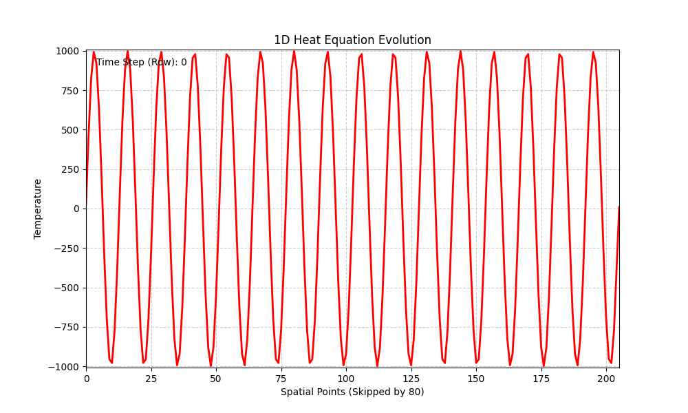

# CUDA Finite-Difference Heat Equation Solver (1D & 2D)

Two CUDA kernels that solve the explicit finite-difference heat/diffusion equation on a GPU, using **temporal blocking in shared memory** so that a single kernel launch advances the simulation many time steps instead of just one. Both versions dump the temperature history to CSV, which the included Python scripts turn into GIFs.

```
PDE_CUDA/
├── 1D-HEAT/
│   ├── 1d_heat.cu
│   ├── visuals.py
│   └── heat_evolution.gif
└── 2D-HEAT/
    ├── 2d_heat_v2.cu
    ├── visuals.py
    └── heat_simulation(2).gif
```

---

## The core idea: temporal blocking

A naive stencil solver launches one kernel per time step — every step pays the full cost of a kernel launch and a global memory round trip just to move data one step forward. Both solvers here instead:

1. Load a tile of the domain **plus a halo region** into shared memory.
2. Iterate the update equation *inside shared memory* for as many steps as the halo allows.
3. Only write back to global memory once, at the end of the kernel.

Each step in, the halo shrinks by one cell on every side (since a halo cell no longer has valid neighbors past it), which is why a halo of size `H` buys you `H` (1D) or `H` (2D, per axis) internal time steps before a fresh kernel launch — and fresh halo load — is needed.

---

## 1D Heat Equation (`1D-HEAT/1d_heat.cu`)

**Update rule:** `u[n, t+1] = u[n, t] + R * (u[n-1, t] + u[n+1, t] - 2*u[n, t])`, with `R = 0.125` and Dirichlet boundaries fixed at `BOUNDARY_TEMP = 10`.

- The rod has `TOTAL_PARTS = TOTAL_BLOCKS * TILESIZE = 16 * 1024 = 16384` points, one thread per point.
- Shared memory per block is `TILESIZE + TOTAL_HALOS = 1024 + 1024 = 2048` floats — 512 halo cells on each side of the 1024-wide tile.
- The first `512` threads of each block load halo data from the neighboring block (or `BOUNDARY_TEMP` if the block is at an edge).
- The kernel then loops `halo_offset` (512) times, each iteration recomputing both the "real" 1024-wide tile *and* the shrinking halo region, syncing threads before and after each write to shared memory.
- After the loop, only the middle 1024 values (no longer backed by valid halo data) are written back to global memory.
- The host loops, launching the kernel, copying the new row out to the host CSV buffer, and copying the kernel's output back into the kernel's input slot for the next launch (`d_U[1] -> d_U[0]`).

**Initial condition:** a sine wave, `1000*sinf(2*PI*x/1024)`
**Output:** `rod_temp_data_skip80.csv` — one row per recorded time block, spatial points sampled every 80 cells.



---

## 2D Heat Equation (`2D-HEAT/2d_heat_v2.cu`)

**Update rule:** standard 5-point stencil, `u_new = u + R*(u_right + u_left + u_up + u_down - 4*u)`, same `R` and Dirichlet boundary.

- Each block owns a `TILESIZE x TILESIZE` (16x16) tile of the plate. Shared memory holds a `SHLOOPDIM x SHLOOPDIM` (5x5) grid of such tiles — a 80x80 region — giving a halo depth of `HALO2 = (SHLOOPDIM/2)*TILESIZE = 32` cells on every side. That's how many internal time steps one kernel launch can advance before the halo runs out.

  > Note: the large comment block at the top of the file walks through several alternative shared-memory budgets (a 9x9 grid of 8x8 tiles, `HALO2 = 4`, etc.) while sizing this out — that was design exploration and isn't what's actually implemented. The code uses the 5x5-grid-of-16x16-tiles configuration described above.

- **Boundary-passing between tiles (`shbx`/`shby`):** within one kernel invocation, the 5x5 tiles are updated one at a time in raster order (`t0 -> t1 -> t2 -> t3 -> ...`). A tile can't read its neighbor's *old* value once that neighbor has already been overwritten with its *new* value. `shbx` and `shby` solve this by caching each tile's boundary column/row right before it gets updated, so the next tile in the sweep can still read the pre-update neighbor value. Because updates only ever need the *previous* tile's old boundary (not the reverse), only the "forward" boundaries need to be cached — this is the fix referred to in the `[BUG FIX-2]` comment.
- `init_temp` seeds the plate with `100*sinf(2*PI*(x + 2y)/SIDE)`.
- The host swaps `d_in`/`d_out` across `KERNEL_TIME_SKIPS` kernel launches before copying a snapshot back to the host, so not every internal time step is recorded — only every `HALO2 * KERNEL_TIME_SKIPS` steps.

**Output:** `2d_heat.csv` — each row is a flattened `SIDE x SIDE` snapshot of the plate.

.gif)

> The GIF filename contains parentheses and a space, which can cause issues with some Markdown/HTML renderers. Consider renaming it to something like `heat_simulation_2.gif` if the image doesn't render.

---

## Building

```bash
nvcc -O3 -o heat1d 1D-HEAT/1d_heat.cu -lm
nvcc -O3 -o heat2d 2D-HEAT/2d_heat_v2.cu -lm
```

Run each binary from inside its own directory (or adjust the output CSV path), since the CSV filenames are hardcoded relative paths.

## Visualizing

Each folder has a `visuals.py` that loads the CSV output with NumPy and renders it to a GIF with Matplotlib (`PillowWriter`) — a line plot for the 1D case, a heatmap (`imshow`, `inferno` colormap) for the 2D case. Run it after generating the corresponding CSV:

```bash
python visuals.py
```

## Known limitations

- No CUDA error checking (`cudaMalloc`/`cudaMemcpy`/kernel launches aren't validated).
- Domain sizes, block counts, and halo depths are compile-time constants (`SIDE`, `TOTAL_BLOCKS`, `TILESIZE`, `SHLOOPDIM`), so `SHLOOPDIM` must stay odd and shared-memory budgets need to be re-derived by hand if these change.
- Both solvers use a fixed Dirichlet boundary (`BOUNDARY_TEMP`); no Neumann/periodic option.
